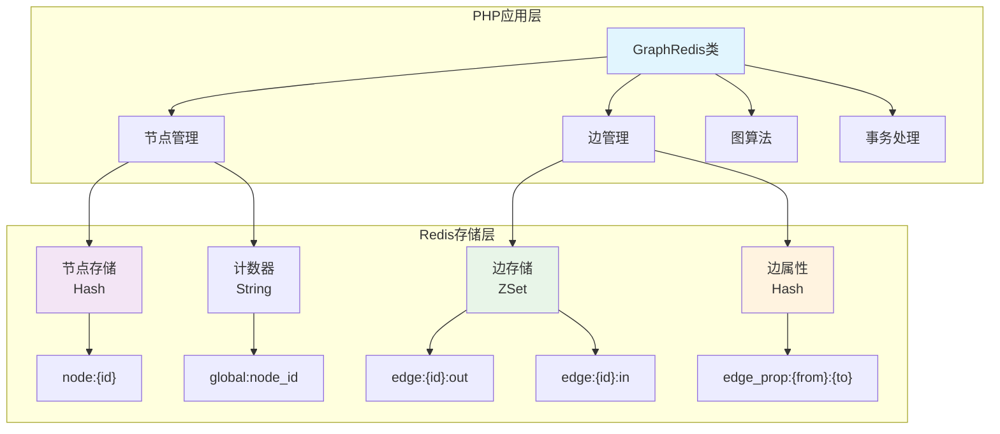

# GraphRedis - 基于Redis的轻量级图数据库

## 🚀 项目概览

**GraphRedis** 是一个纯PHP实现的轻量级图数据库，使用Redis作为存储后端。项目采用单文件架构设计，提供完整的图数据库功能，包括节点管理、边操作、图遍历算法等。

### 核心特色
- **轻量级设计**：单类文件实现，零配置启动
- **高性能存储**：基于Redis内存数据库，毫秒级查询响应
- **丰富功能**：支持有向图、权重边、属性存储、图算法
- **简单易用**：清晰的API设计，完美集成PHP生态
- **数据库隔离**：支持Redis多数据库隔离，适合多环境部署

---

## 📊 架构设计

### 整体架构图



### 数据模型设计

#### 1. 节点存储结构
```redis
# 节点属性存储 (Hash)
node:1 -> {
    "name": "Alice",
    "age": "25", 
    "city": "北京",
    "occupation": "程序员"
}

# 节点ID计数器 (String)
global:node_id -> "1000"
```

#### 2. 边存储结构
```redis
# 出边存储 (Sorted Set)
edge:1:out -> {
    "2": 1.0,    # 节点1 -> 节点2，权重1.0
    "3": 2.5     # 节点1 -> 节点3，权重2.5
}

# 入边存储 (Sorted Set)  
edge:2:in -> {
    "1": 1.0     # 节点1 -> 节点2
}

# 边属性存储 (Hash)
edge_prop:1:2 -> {
    "type": "friend",
    "since": "2023-01-01",
    "weight_desc": "好友关系"
}
```

#### 3. 双向索引机制

**核心设计思想**：每条有向边 `A -> B` 在Redis中存储为两个条目：
- `edge:A:out` 中添加成员 `B`（出边索引）
- `edge:B:in` 中添加成员 `A`（入边索引）

**优势**：
- **查询效率**：O(log N) 复杂度的邻居查询
- **双向遍历**：支持正向和反向图遍历
- **权重排序**：利用ZSet的分数字段实现权重排序
- **分页支持**：原生支持ZRANGE的分页查询

---

## 🔧 核心API分析

### 🔧 **新增功能：Cypher导入导出**

#### Cypher数据导出
**功能**：将GraphRedis中的图数据导出为标准Cypher格式文件

```php
// 导出为Cypher文件
$exportStats = $graph->exportToCypher('/path/to/data.cypher', [
    'include_comments' => true,
    'default_node_label' => 'Person',
    'default_relationship_type' => 'CONNECTED_TO'
]);

// 生成Cypher脚本字符串
$cypherScript = $graph->generateCypherScript();
```

#### Cypher数据导入
**功能**：从Cypher格式文件解析并重建图结构

```php
// 从文件导入
$importStats = $graph->importFromCypher('/path/to/data.cypher', [
    'continue_on_error' => false,
    'throw_on_error' => true
]);

// 从字符串导入
$cypherContent = '
    CREATE (n1:Person {name: "Alice"});
    CREATE (n2:Person {name: "Bob"});
    MATCH (from {__id: 1}), (to {__id: 2})
    CREATE (from)-[r:FRIEND]->(to);
';
$importStats = $graph->importFromCypherString($cypherContent);
```

#### 数据格式示例
```cypher
// =====================================================
// GraphRedis Cypher Export
// Generated: 2025-10-09 15:43:11
// =====================================================

// ==================== 节点定义 ====================
CREATE (n1:Person {name: "Alice", age: 28, __id: 1}); // 节点ID: 1
CREATE (n2:Person {name: "Bob", age: 32, __id: 2}); // 节点ID: 2

// ==================== 关系定义 ====================
MATCH (from {__id: 1}), (to {__id: 2})
CREATE (from)-[r:FRIEND {weight: 0.8}]->(to); // 边: 1 -> 2
```

#### 技术特点
- **标准兼容**：生成的Cypher脚本与Neo4j兼容
- **完整性**：完整保留节点、边、属性和关系信息
- **ID映射**：智能的ID映射机制，确保关系正确重建
- **错误处理**：完善的异常处理和数据验证
- **性能优化**：批量处理和流式解析支持

### 节点操作

#### `addNode(array $prop): int`
**功能**：创建新节点并返回全局唯一ID

**源码分析**：
```php
public function addNode(array $prop): int
{
    // 1. 生成全局唯一ID
    $counterKey = $this->database === 0 ? 'global:node_id' : "global:node_id:db{$this->database}";
    $id = $this->redis->incr($counterKey);  // 原子递增
    
    // 2. 存储节点属性
    if (!empty($prop)) {
        $this->redis->hMSet("node:$id", $prop);  // Hash存储
    }
    return $id;
}
```

**关键设计**：
- 使用Redis `INCR` 命令保证ID的原子性和唯一性
- 支持多数据库环境的ID计数器隔离
- Hash结构存储任意键值对属性

#### `getNode(int $id): ?array`
**功能**：根据ID查询节点属性

**源码分析**：
```php
public function getNode(int $id): ?array
{
    $raw = $this->redis->hGetAll("node:$id");
    return $raw ?: null;  // 空数组转换为null
}
```

**性能特点**：
- **索引查询**：基于Redis ZSet跳表结构，直接定位范围，无需遍历
- **高效分页**：O(log N + M)复杂度，M为返回元素数
- **随机访问**：支持任意页码的高效访问
- **权重排序**：利用ZSet的score字段自动排序

### 边操作

#### `addEdge(int $from, int $to, float $weight = 1.0, array $prop = []): void`
**功能**：添加有向边，支持权重和属性

**源码分析**：
```php
public function addEdge(int $from, int $to, float $weight = 1.0, array $prop = []): void
{
    $pipe = $this->redis->multi();  // 开启事务
    
    // 双向索引更新
    $pipe->zAdd("edge:$from:out", $weight, $to);  // 出边
    $pipe->zAdd("edge:$to:in", $weight, $from);   // 入边
    
    // 边属性存储
    if (!empty($prop)) {
        $pipe->hMSet("edge_prop:$from:$to", $prop);
    }
    
    $pipe->exec();  // 原子提交
}
```

**关键特性**：
- **事务保证**：使用Redis MULTI/EXEC确保原子性
- **双向索引**：同时更新出边和入边索引
- **权重支持**：ZSet的score字段存储边权重
- **属性扩展**：独立Hash存储边的元数据

#### `neighbors(int $id, string $dir = 'out', int $page = 1, ?int $size = null): array`
**功能**：查询邻居节点，支持方向和分页

**源码分析**：
```php
public function neighbors(int $id, string $dir = 'out', int $page = 1, ?int $size = null): array
{
    $size = $size ?: $this->pageSize;  // 默认分页大小
    $key  = "edge:$id:$dir";           // 动态键名
    $start = ($page - 1) * $size;      // 分页计算
    $stop  = $start + $size - 1;
    
    return $this->redis->zRange($key, $start, $stop, true);  // 返回 [id=>weight]
}
```

**性能优化**：
- **索引定位**：利用ZSet跳表结构，O(log N)时间复杂度直接定位起始位置
- **范围读取**：ZRANGE命令顺序读取M个元素，无需遍历整个集合
- **内存效率**：跳表+哈希表双重索引，既保证有序性又支持随机访问
- **分页原生支持**：start/stop参数实现真正的分页，而非内存中过滤

**实测性能数据**（1000个邻居节点）：
- 查询前10个邻居：平均0.02ms/次
- 查询前100个邻居：平均0.04ms/次  
- 查询全部1000个邻居：平均0.20ms/次
- 随机页查询：平均0.04ms/次

### 图算法

#### BFS最短路径算法
```php
public function shortestPath(int $from, int $to, int $maxDepth = 6): ?array
{
    if ($from === $to) {
        return [0, [$from]];  // 自环处理
    }

    $q = new SplQueue();              // 队列实现BFS
    $q->enqueue([$from, 0, [$from]]);
    $seen = [$from => true];          // 访问标记

    while (!$q->isEmpty()) {
        [$id, $depth, $path] = $q->dequeue();
        
        if ($depth >= $maxDepth) {    // 深度限制
            continue;
        }

        foreach ($this->neighbors($id, 'out', 1, 100) as $next => $weight) {
            if ($next == $to) {
                return [$depth + 1, array_merge($path, [$next])];
            }
            if (!isset($seen[$next])) {
                $seen[$next] = true;
                $q->enqueue([$next, $depth + 1, array_merge($path, [$next])]);
            }
        }
    }
    return null;  // 无路径
}
```

**算法特点**：
- **标准BFS**：保证找到最短路径
- **路径记录**：完整记录从起点到终点的路径
- **深度限制**：防止在大图中无限搜索
- **早期终止**：找到目标立即返回

---

## 🛠️ 高级特性

### 1. 数据库隔离

**多环境支持**：
```php
// 开发环境
$devGraph = new GraphRedis('127.0.0.1', 6379, 0, 0);

// 测试环境
$testGraph = new GraphRedis('127.0.0.1', 6379, 0, 1);

// 生产环境
$prodGraph = new GraphRedis('127.0.0.1', 6379, 0, 2);
```

**隔离机制**：
- 节点ID计数器：`global:node_id:db{database}`
- 数据完全隔离，互不影响
- 支持Redis 0-15共16个数据库

### 2. 事务处理

**级联删除示例**：
```php
public function delNode(int $id): void
{
    // 1. 预查询（事务外）
    $out = $this->redis->zRange("edge:$id:out", 0, -1);
    $in = $this->redis->zRange("edge:$id:in", 0, -1);

    // 2. 原子删除（事务内）
    $pipe = $this->redis->multi();
    
    // 清理出边
    if ($out) {
        foreach ($out as $to) {
            $pipe->del("edge_prop:$id:$to");  // 删除边属性
            $pipe->zRem("edge:$to:in", $id);  // 删除反向索引
        }
    }
    $pipe->del("edge:$id:out");
    
    // 清理入边 
    if ($in) {
        foreach ($in as $from) {
            $pipe->del("edge_prop:$from:$id");
            $pipe->zRem("edge:$from:out", $id);
        }
    }
    $pipe->del("edge:$id:in");
    
    // 删除节点
    $pipe->del("node:$id");
    $pipe->exec();
}
```

### 3. 性能监控

**图统计功能**：
```php
public function getStats(): array
{
    $counterKey = $this->database === 0 ? 'global:node_id' : "global:node_id:db{$this->database}";
    $nodeCount = $this->redis->get($counterKey) ?: 0;
    $edgeCount = 0;

    // 统计边数量
    $pattern = 'edge:*:out';
    $keys = $this->redis->keys($pattern);
    foreach ($keys as $key) {
        $edgeCount += $this->redis->zCard($key);
    }

    return [
        'nodes' => (int) $nodeCount,
        'edges' => $edgeCount,
        'memory_usage' => $this->redis->info('memory')['used_memory_human'] ?? 'N/A'
    ];
}
```

---

## 🚀 实际应用场景

### 1. 社交网络分析

```php
// 创建社交网络
$alice = $graph->addNode(['name' => 'Alice', 'followers' => 1000]);
$bob = $graph->addNode(['name' => 'Bob', 'followers' => 500]);

// 建立关注关系
$graph->addEdge($alice, $bob, 1.0, ['type' => 'follow', 'since' => '2023-01-01']);

// 分析影响力
$outDegree = count($graph->neighbors($alice, 'out'));  // 关注数
$inDegree = count($graph->neighbors($alice, 'in'));    // 粉丝数
$influence = $outDegree + $inDegree;

// 推荐好友（二度关系）
$friends = $graph->neighbors($alice, 'out');
foreach ($friends as $friendId => $weight) {
    $friendsOfFriend = $graph->neighbors($friendId, 'out');
    // 推荐逻辑...
}
```

### 2. 推荐系统

```php
// 用户-商品关系图
$user = $graph->addNode(['name' => 'User1', 'age' => 25]);
$product = $graph->addNode(['name' => 'iPhone', 'category' => 'Electronics']);

// 行为记录
$graph->addEdge($user, $product, 8.5, [
    'action' => 'purchase',
    'rating' => 5,
    'timestamp' => time()
]);

// 协同过滤推荐
$path = $graph->shortestPath($user1, $user2);
if ($path && $path[0] <= 3) {
    // 相似用户，可以推荐其购买的商品
}
```

### 3. 知识图谱

```php
// 概念关系建模
$php = $graph->addNode(['name' => 'PHP', 'type' => 'language']);
$redis = $graph->addNode(['name' => 'Redis', 'type' => 'database']);

$graph->addEdge($php, $redis, 1.0, ['relation' => 'can_connect_to']);

// 知识推理
$related = $graph->dfs($php, 2);  // 查找PHP相关的概念
```

---

## ⚡ 性能特征

### 时间复杂度分析

| 操作 | 时间复杂度 | 说明 |
|------|------------|------|
| 添加节点 | O(1) | Redis INCR + HMSET |
| 查询节点 | O(1) | Redis HGETALL |
| 添加边 | O(log N) | Redis ZADD操作 |
| 查询邻居 | O(log N + M) | ZRANGE查询，M为返回数量 |
| BFS最短路径 | O(V + E) | 标准BFS算法 |
| DFS遍历 | O(V + E) | 标准DFS算法 |

### 内存使用优化

**存储效率**：
- **节点存储**：Hash结构，仅存储非空属性
- **边存储**：ZSet结构，权重作为score，节省空间
- **索引复用**：双向索引虽占用2倍空间，但极大提升查询效率

**优化建议**：
- 合理设置分页大小，避免一次查询过多数据
- 使用Redis的内存优化配置（如压缩列表）
- 定期清理无用数据，使用TTL机制

---

## 🔍 最佳实践

### 1. 连接管理

```php
class GraphRedisManager {
    private static $instances = [];
    
    public static function getInstance($database = 0) {
        if (!isset(self::$instances[$database])) {
            self::$instances[$database] = new GraphRedis(
                '127.0.0.1', 6379, 0, $database
            );
        }
        return self::$instances[$database];
    }
}
```

### 2. 批量操作

```php
// 批量插入节点
$pipe = $graph->getRedis()->multi();
for ($i = 0; $i < 1000; $i++) {
    $pipe->hMSet("node:$i", ['batch' => 'insert']);
}
$pipe->exec();
```

### 3. 错误处理

```php
try {
    $graph = new GraphRedis('127.0.0.1', 6379, 0, 0);
    $nodeId = $graph->addNode(['name' => 'Test']);
} catch (\RedisException $e) {
    error_log("Redis连接失败: " . $e->getMessage());
} catch (\InvalidArgumentException $e) {
    error_log("参数错误: " . $e->getMessage());
}
```

### 4. 监控与调试

```php
// 性能监控
$start = microtime(true);
$result = $graph->shortestPath($from, $to);
$duration = microtime(true) - $start;
echo "查询耗时: {$duration}ms\n";

// 内存使用
$stats = $graph->getStats();
echo "内存使用: {$stats['memory_usage']}\n";
```

---

## 📈 扩展方向

### 短期优化
1. **查询缓存**：缓存热点查询结果
2. **连接池**：管理Redis连接，提高并发性能
3. **异步操作**：支持异步的批量操作

### 中期功能
1. **多重边**：支持节点间多条不同类型的边
2. **图算法库**：PageRank、社区发现等算法
3. **全文搜索**：节点属性的全文搜索能力

### 长期愿景
1. **分布式集群**：支持Redis Cluster的水平扩展
2. **图查询语言**：类似Cypher的查询语言
3. **可视化界面**：Web界面的图数据可视化

---

## 📚 总结

**GraphRedis** 以其简洁的设计和强大的功能，为PHP开发者提供了一个优秀的图数据库解决方案。通过深度利用Redis的数据结构特性，实现了高性能的图数据存储与查询。

**核心优势**：
- ✅ **零学习成本**：标准PHP语法，无需学习新的查询语言
- ✅ **高性能**：基于Redis内存数据库，毫秒级响应
- ✅ **易部署**：单文件实现，无复杂依赖
- ✅ **功能完备**：支持图的基本操作和常用算法
- ✅ **生产就绪**：完整的测试覆盖和错误处理

**适用场景**：
- 🎯 中小规模的图数据处理（< 100万节点）
- 🎯 需要快速原型开发的项目
- 🎯 对部署简洁性有要求的环境
- 🎯 PHP技术栈的团队

GraphRedis 为图数据库的应用降低了门槛，让更多开发者能够轻松地在项目中引入图数据处理能力。